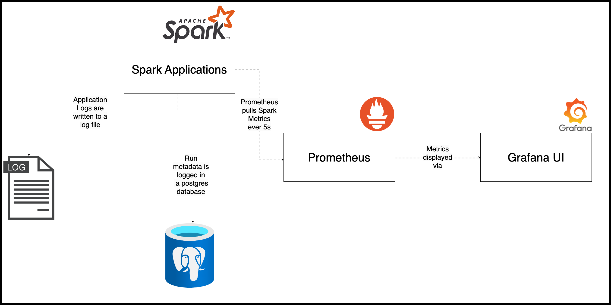

# Data Engineering Best Practices - #2. Logging

Code for blog at [Data Engineering Best Practices - #2. Logging](https://www.startdataengineering.com/post/de_best_practices_log/)

This is part of a series of posts about data engineering best practices:

1. [Data Engineering Best Practices - #1. Data flow & Code](https://www.startdataengineering.com/post/de_best_practices/)
2. [Data Engineering Best Practices - #2. Logging](https://www.startdataengineering.com/post/de_best_practices_log/)

# Project 

For project overview and architecture refer to [this Data flow & code repo](https://github.com/josephmachado/data_engineering_best_practices).

# Setup

If you'd like to code along, you'll need 

**Prerequisite:**

1. [git version >= 2.37.1](https://github.com/git-guides/install-git)
2. [Docker version >= 20.10.17](https://docs.docker.com/engine/install/) and [Docker compose v2 version >= v2.10.2](https://docs.docker.com/compose/#compose-v2-and-the-new-docker-compose-command). Make sure that docker is running using `docker ps`
3. [pgcli](https://www.pgcli.com/install)

Run the following commands via the terminal. If you are using Windows, use [WSL](https://ubuntu.com/tutorials/install-ubuntu-on-wsl2-on-windows-10#1-overview) to set up Ubuntu and run the following commands via that terminal.

```bash
git clone https://github.com/josephmachado/data_engineering_best_practices_log.git
cd data_engineering_best_practices_log
make up # Spin up containers
make ddl # Create tables & views
make ci # Run checks & tests
make etl # Run etl
make spark-sh # Spark shell to check created tables
```

```scala
spark.sql("select partition from adventureworks.sales_mart group by 1").show() // should be the number of times you ran `make etl`
spark.sql("select count(*) from businessintelligence.sales_mart").show() // 59
spark.sql("select count(*) from adventureworks.dim_customer").show() // 1000 * num of etl runs
spark.sql("select count(*) from adventureworks.fct_orders").show() // 10000 * num of etl runs
:q // Quit scala shell
```

You can see the results of DQ checks and metadata as shown below. Open the metadata cli using `make meta`

```sql
select * from ge_validations_store limit 1;
select * from run_metadata limit 2;
exit
```

Use `make down` to spin down containers.

# Logging architecture



# Infrastructure components

1. **Spark applications**: We have spark standalone cluster. When we submit a spark job a new spark application will be created and its UI will be available at [localhost:4040](http://localhost:4040/)
2. **Metadata DB**: We have a postgres container that is used to store results of data quality checks (run by Great Expectations) and we store run information (table: run_metadata) in this database as well. You can access the metadata db using the `make meta` command.
3. **Prometheus**: We have a Prometheus server running, and we have a Prometheus job that runs ever 5s ([configured here](monitoring/prometheus/prometheus.yml)) to pull spark metrics (via [Spark PrometheusServlet](https://spark.apache.org/docs/3.0.0/monitoring.html#executor-metrics)). Prometheus is available at [localhost:9090](http://localhost:9090/).
4. **Grafana**: We have a Grafana service running as the UI for prometheus data. Grafana is available at [localhost:3000](http://localhost:3000/login), with username admin and password spark.

# Future Work

1. Setup Dashboard configuration for Grafana to display Spark metrics.
2. Move log storage from local filesystem to a service like [Grafana Loki](https://grafana.com/docs/loki/latest/).
3. Display metadata and Data quality results in Grafana UI.
4. Add type information or make the metadata into a JSON. 